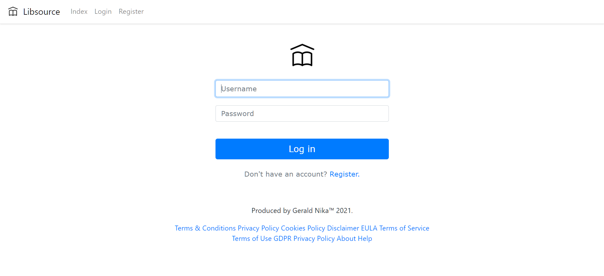

## README

# License
libsource is open-sourced software licensed under the MIT license.

# Libsource
-> "libsource" is an educational web product that helps students who want to explore, or order books in a library. This library management system is built on top of Adequate framework (framework developed by Gerald Nika) and comes with a flat minimalist and responsive design.
Created in 2018.

# Getting Started
-> These instructions will get you a copy of the project up and running on your local machine for development and testing purposes. See deployment for notes on how to deploy the project on a live system.

# Prerequisites
-> To run this software on your machine you need to have:
	
	A windows host			:	Windows x64
	PHP Version 			:	7.2.5
	Server version 			:	10.1.32-MariaDB
	phpMyAdmin Version 		:	4.8.2

# Installation
-> To be able to run this properly you should:
	
	1. Open the configurations folder and change in the 'configuration.php' file these fields:
		BASE 				-> 		Replace with your host address
									(DONT FORGET THE TRAILING (/) SLASH AT THE END!);
		DATABASE_HOST 		-> 		Replace with your host address;
		DATABASE_NAME 		-> 		Replace with your database name;
		DATABASE_USERNAME 	-> 		Replace with your database username;
		DATABASE_PASSWORD 	-> 		Replace with your database password;
		HASH_GENERAL_KEY	->		Replace with your desired general key;
		HASH_PASSWORD_KEY	->		Replace with your desired database key;

	2. Create a database record of admin credentials in admin table
		(Admins are created in phpMyAdmin manually)

# Details
-> Built With:
	
	PHP Version: 7.2.5
	Bootstrap Version: 4.1.1
	Sublime Text Version: Build 3176 for Windows x64
	Apache/2.4.33 (Win32) OpenSSL/1.1.0h PHP/7.2.5 Server at localhost Port 80
	Created: ‎Tuesday, ‎May ‎7, ‎2018, ‏‎2:18:55 AM
	Last modified: 2018-07-08 10:29
	Size: 473 KB (484,750 bytes)
	Contains: 91 Files, 32 Folders

# Authors:
Gerald Nika - Creator.

# Acknowledgments:
To those students who aim knowledge.

***

***

***

***

***

***

***

***

***

***

***

***

***

***

***

***